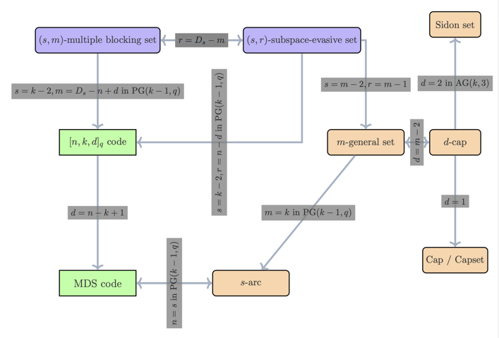

# Bachelor's Thesis: _On m-general sets in AG(k,q) and PG(k,q): Sidon sets, projective arcs and error-correcting codes_

This repository contains the scripts and code used for researching m-general sets in affine and projective space as part of my Bachelor's Thesis. In particular, you can find Python and Matlab scripts that explore m-general sets for m = 3,4,5 in affine and projective space in small dimensions over the Galois fields of order 2 and 3. 

A separate part of the thesis investigated the application of a new LLM approach introduced by Google Deepmind on 4-general (Sidon) sets in AG(k,3). The respective repository can be found here: https://github.com/timneumann1/FunSearch-Sidon.
